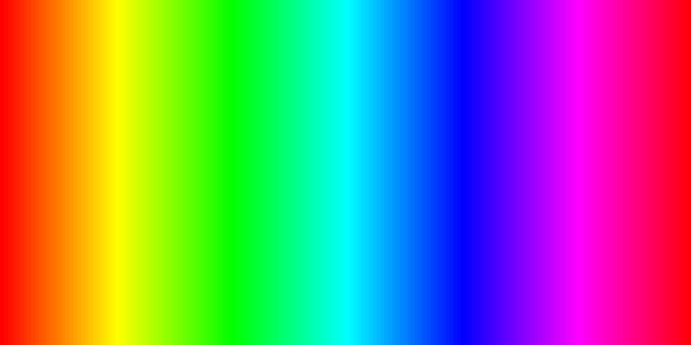

### 📝 Code Snippet

```cpp
void CMainDialog::OnExample4(wxCommandEvent& event) {
    cv::Mat img(512,256,CV_8UC3);
    DisplayImage(img,0,0,true,false);
}
```

### 📷 Output Image


> garbage값 

-------

### 📝 Code Snippet

```cpp
void CMainDialog::OnExample4(wxCommandEvent& event) {
    cv::Mat img(512,256,CV_8UC3,cv::Scalar(0,0,0));
    DisplayImage(img,0,0,true,false);
}
```

### 📷 Output Image


> 모든 픽셀을 (0,0,0)으로 초기화

-------

### 📝 Code Snippet

```cpp
cv::Mat createRainbowImage(int height, int width) {
	cv::Mat rainbowHSV(height, width, CV_8UC3);

	for (int r = 0; r < height; r++) {
		for (int c = 0; c < width; c++) {
			int hue = static_cast<int>(180.0 * c / width);
			rainbowHSV.at<cv::Vec3b>(r, c) = cv::Vec3b(hue, 255, 255);
		}
	}

	cv::Mat rainbowBGR;
	cv::cvtColor(rainbowHSV, rainbowBGR, cv::COLOR_HSV2BGR);
	return rainbowBGR;
}
void CMainDialog::OnExample2(wxCommandEvent& event) {
	cv::Mat img = createRainbowImage(512, 1024);
	DisplayImage(img, 0, 0, true, false);
}
```

### 📷 Output Image



> HSV : hue(색상), saturation(채도), value(밝기)에서 hue값을 바꾸면 무지개를 만들기 쉽다.