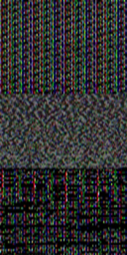

### 📝 Code Snippet

```cpp
void CMainDialog::OnExample4(wxCommandEvent& event) {
    cv::Mat img(512,256,CV_8UC3);
    DisplayImage(img,0,0,true,false);
}
```

### 📷 Output Image



> garbage값 

-------

### 📝 Code Snippet

```cpp
void CMainDialog::OnExample4(wxCommandEvent& event) {
    cv::Mat img(512,256,CV_8UC3,cv::Scalar(0,0,0));
    DisplayImage(img,0,0,true,false);
}
```

### 📷 Output Image


> 모든 픽셀을 (0,0,0)으로 초기화