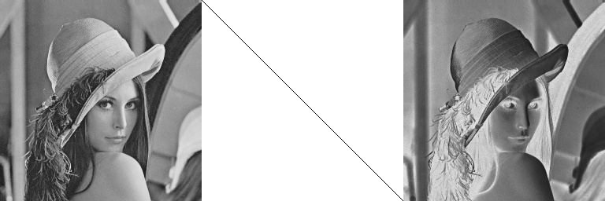

### 📝 Code Snippet

```cpp
void CMainDialog::OnExample2(wxCommandEvent& event) {
	//마지막 선택된 이미지
	CKcImage kcImage = GetLastSelImage(0);
	if (kcImage.cvImage.empty()) return;
	cv::Mat img = kcImage.cvImage.clone();
	cv::Mat rot = cv::getRotationMatrix2D(cv::Point2f(img.cols / 2, img.rows / 2), 45, 1);

	for (int i = 0; i < 1000; i++) {
		cv::warpAffine(img, img, rot, img.size());
	}

	DisplayImage(img, kcImage.pos.x, kcImage.pos.y, true, false);
}
```

### 📷 Output Image


> 1000번 돌려서 흐릿해짐

-------
### 📝 Code Snippet

```cpp
cv::Mat Draw_Graph() {
	cv::Mat img(256, 256, CV_8UC1, cv::Scalar(255));
	for (int c = 0; c < 256; c++) {
		int r = Intensity_Transformation(c);
		img.at<uchar>(255 - r, c) = 0;
	}
	return img;
}

cv::Mat Apply_Transform(cv::Mat src) {
	cv::Mat ret = src.clone();
	for (int r = 0; r < ret.rows; r++) {
		for (int c = 0; c < ret.cols; c++) {
			ret.at<uchar>(r, c) = Intensity_Transformation(ret.at<uchar>(r, c));
		}
	}
	return ret;
}

void CMainDialog::OnExample3(wxCommandEvent& event) {
	CKcImage kcImage = GetLastSelImage(0);
	if (kcImage.cvImage.empty()) return;
	cv::Mat img = kcImage.cvImage.clone();
	cv::cvtColor(img, img, cv::COLOR_BGR2GRAY);

	cv::Mat graph = Draw_Graph();
	cv::Mat transformed = Apply_Transform(img);
	cv::Mat combined;

	cv::hconcat(std::vector<cv::Mat>{img, graph, transformed}, combined);
	DisplayImage(combined, kcImage.pos.x, kcImage.pos.y, true, false);
}
```

### 📷 Output Image

```cpp
int Intensity_Transformation(int x) {
	return 255 - x;
}
```


> Image Negatives
```cpp
int Intensity_Transformation(int x) {
	return (int)((255.0 / 8.0) * std::log2(x + 1));
}
```


> Log Transformations
```cpp
int Intensity_Transformation(int x) {
	if (x < 128) return 0;
	else return 255;
}
```


> binarization
```cpp
int Intensity_Transformation(int x) {
	double gamma = 0.4;
	double c = 255.0 / std::pow(255, gamma);
	return (int)(c * std::pow(x, gamma));
}
```


> Power-Law Transformation (gamma = 0.4)
```cpp
int Intensity_Transformation(int x) {
	double gamma = 2.5;
	double c = 255.0 / std::pow(255, gamma);
	return (int)(c * std::pow(x, gamma));
}
```


> Power-Law Transformation (gamma = 2.5)
-------